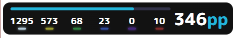
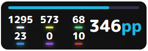

# Instructions.

1. extract StreamCompanion.zip somewhere
2. make sure the folder extracted is named "StreamCompanion" and the next layer is named "Files"
3. drag the StreamCompanion folder that you just extracted over the 'real' StreamCompanion folder (pretty much just putting the stuffs in it)  
** make sure it asks you if you want to replace 1 file called "tokenTransformer.js"  
*** if no prompt for overwriting file appears you can press ctrl+z to undo
___

### To use the overlay as a streaming element, go to the default SCoverlays localhost port

*(can be opened from StreamCompanion through the second button from the left, when hovered should read "Web overlays")
___
### To use the overlay as an overlay in game, you must install [StreamCompanion-BrowserOverlay](https://github.com/Piotrekol/StreamCompanion/releases/) extension

If the browser overlay doesn't work, install the text overlay too. It might fix it(idk why it's like this but it fixes it, I have this issue)

the overlay can then be added normally  

the recommended canvas size for the overlay is `width: 470, height: 75`

the recommended canvas size for V.2 overlay is `width: 310, height: 110`

## preview of overlays

### !yoth99

Made to meet my needs

### !yoth99 V.2

Made for palmEuEi to use since he uses a wider stage